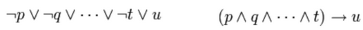
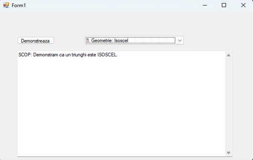
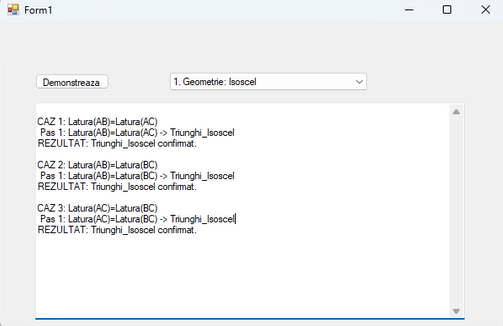
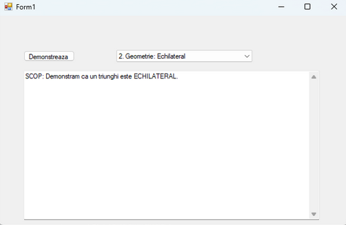
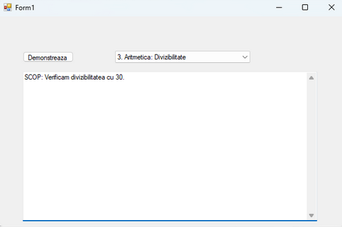
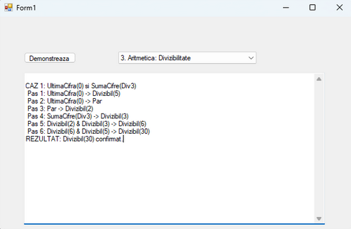

# Inferență Predicativă prin Raționament Înainte

**Coordonator:**
profesor dr. ing. Mircea Hulea

**Studenți:**
Afloroaei Daniel și
Mârț Eduard

---

## 1. Descrierea problemei considerate

În acest proiect am implementat un "motor de inteligență" care poate să rezolve singur probleme de matematică folosind logică. Sistemul utilizează un set de **fapte inițiale (axiome)** și o **bază de cunoștințe (reguli)** pentru a deduce noi cunoștințe sau concluzii, demonstrând astfel capacitatea de raționament.

Au fost abordate două domenii distincte pentru validarea funcționalității motorului de inferență:
* **Geometrie:** Programul primește ca input informații despre lungimile laturilor unui triunghi și trebuie să determine prin raționament dacă acesta este un triunghi Isoscel sau Echilateral.
* **Aritmetică:** Programul primește un număr și verifică proprietatea de divizibilitate cu 30, utilizând reguli intermediare de divizibilitate (ex: paritate, divizibilitatea cu 5, cu 6, etc.).

## 2. Aspecte teoretice

### 2.1. Algoritmul de Inferență: Raționamentul Înainte (Forward Chaining)

Motorul de inferență dezvoltat utilizează ca algoritm fundamental **Raționamentul Înainte (Forward Chaining)**. Această metodă reprezintă o strategie de inferență dirijată de date, în care procesul pornește de la un set de **fapte inițiale** cunoscute și aplică în mod iterativ și sistematic **regulile** din baza de cunoștințe. Scopul este de a genera concluzii noi, până când setul de cunoștințe este saturat sau este atins obiectivul dorit.

### 2.2. Fundamente Logice

Implementarea se bazează pe două principii teoretice fundamentale din logica predicatelor și cea propozițională, esențiale pentru transpunerea sistemului într-un mediu computațional: Propoziționalizarea și Teorema lui Herbrand.

În mod ideal, logica predicatelor de ordinul I permite formule cu variabile și cuantificatori, rezultând o mulțime de termeni potențial infinită. Pentru a eficientiza operațiile într-un sistem automatizat, este necesară **propoziționalizarea** bazei de cunoștințe.

Conform **Teoremei lui Herbrand**, dacă o bază de cunoștințe de ordinul I implică o anumită propoziție, atunci demonstrația acesteia poate fi realizată cu o submulțime **finită** a bazei de cunoștințe propoziționalizate. În cadrul acestui proiect, s-a aplicat acest principiu prin definirea unui set finit de fapte și reguli (fără variabile infinite), transformând astfel predicatele complexe în simboluri propoziționale gestionabile, ceea ce garantează posibilitatea de a găsi o demonstrație în timp finit.

**Mecanismul de Inferență: Modus Ponens.**
Odată ce baza de cunoștințe a fost redusă la o formă propozițională, motorul de inferență utilizează regula **Modus Ponendo Ponens** (sau simplu, Modus Ponens) ca mecanism de execuție.

În contextul Raționamentului Înainte, regulile sunt reprezentate sub formă de **clauze Horn definite**, care sunt disjuncții cu un singur termen pozitiv, echivalente cu o implicație:



### 2.3. Funcționarea Iterativă a Algoritmului

Procesul de căutare a concluziilor este modelat printr-un sistem de producție, unde deducția este realizată prin parcurgerea iterativă a bazei de cunoștințe, conform următorilor pași ciclici:
1.  **Inițializare (Starea Rădăcină):** Se pornește de la starea inițială, reprezentată de setul de fapte furnizate în ipoteză (axiomele problemei).
2.  **Matching (Potrivire):** Se parcurg toate regulile din baza de cunoștințe pentru a identifică acele reguli a căror parte stângă (antecedentul sau setul de premise) se potrivește integral cu faptele existente în memoria de lucru.
3.  **Firing (Declanșare):** Prin aplicarea regulii **Modus Ponens**, se activează concluzia (partea dreaptă a regulii), care reprezintă un fapt nou.
4.  **Saturație:** Faptul nou este adăugat în memoria de lucru.
5.  Procedura se reia (pasul 2) și continuă până când nu mai poate fi dedusă nicio informație nouă sau până când este atins un fapt considerat a fi starea scop.

## 3. Modalitatea de Rezolvare

Sistemul a fost implementat în limbajul de programare **C#**, utilizând cadrul **Windows Forms** pentru interfața grafică. Arhitectura sistemului este modulară, fiind structurată pe trei componente principale:

**a) Faptele (Memoria de lucru)**
* **Structura de date:** A fost utilizată colecția `HashSet<string>` pentru stocarea faptelor cunoscute la un moment dat.
* **Justificare:** Alegerea HashSet a fost motivată de necesitatea optimizării operațiilor de căutare și verificare a existenței unui fapt, care sunt frecvențe în procesul de inferență. `HashSet` oferă o complexitate de timp O(1) (constantă) pentru aceste operații, fiind mult mai rapid decât o simplă listă.

**b) Regulile (Baza de cunoștințe)**
* **Implementare:** Regulile de inferență sunt definite static (hardcodate) în cadrul codului sursă, fiind organizate sub forma unei colecții de obiecte (de exemplu, `List<Regula>`) inițializate la pornirea aplicației.
* **Structură:** Fiecare regulă este instanța unei clase dedicate (clasa `Regula`), care încapsulează o listă de **premise** necesare și **concluzia** care rezultă din satisfacerea acestora.
* **Justificare și Avantaje:** Această abordare orientată pe obiecte asigură **integritatea datelor** și elimină riscul erorilor de sintaxă care ar putea apărea la citirea din fișiere text externe. De asemenea, definirea regulilor direct în cod permite verificarea validității acestora în momentul compilării (compile time safety) și asigură o viteză maximă de accesare a bazei de cunoștințe în timpul rulării motorului de inferență.

**c) Motorul de Inferență**
* **Mecanism:** Acesta este nucleul sistemului și operează printr-o buclă `while` iterativă.
* **Funcționare:** La fiecare iterație, motorul parcurge lista de reguli, căutând regulile ale căror premise se potrivesc integral cu faptele curente din memoria de lucru.
* **Deducție:** În momentul în care o regulă declanșează o concluzie nouă (un fapt necunoscut anterior), acesta este adăugat în memoria de lucru.
* **Condiție de oprire:** Procesul se reia de la capăt (din cauza adăugării unui fapt nou) și continuă până când o iterație completă nu mai reușește să deducă și să adauge niciun fapt nou.

## 4. Părțile Importante din Codul Sursă

### 4.1. Structura de date pentru Reguli

```csharp
public class Regula
{
    public string[] Premise;
    public string Concluzie;
    public bool Activata;

    public Regula(string[] p, string c) { this.Premise = p; this.Concluzie = c; this.Activata = false; }
}
```

### 4.2. Motorul de Inferență (ExecutaInferenta)

```csharp
private void ExecutaInferenta()
{
    bool schimbare = true; //Daca am gasit noi informatii
    int pas = 1;

    while (schimbare)
    {
        schimbare = false;
        foreach (Regula r in bazaDeCunostinte)
        {
            //Verific doar regulile care nu au fost deja activate
            if (r.Activata == false)
            {
                bool toateOk = true;
                foreach (string p in r.Premise)
                {
                    if (memoriaDeLucru.Contains(p) == false) { toateOk = false; break; }
                }

                //Daca premisele sunt indeplinite aplic Modus Ponens
                if (toateOk)
                {
                    memoriaDeLucru.Add(r.Concluzie);
                    r.Activata = true;
                    schimbare = true;

                    textBox1.AppendText(" Pas " + pas + ": " + string.Join(" & ", r.Premise) + " -> " + r.Concluzie + "\r\n");
                    pas++;
                }
            }
        }
    }

    if (memoriaDeLucru.Contains(faptTinta))
        textBox1.AppendText("REZULTAT: " + faptTinta + " confirmat.\r\n");
    else
        textBox1.AppendText("REZULTAT: Nu s-a putut demonstra.\r\n");
}
```

### 4.3. Încărcarea și Parsarea Regulilor

```csharp
private void IncarcaReguliDirect(string scenariu)
{
    bazaDeCunostinte.Clear();

    if (scenariu.Contains("Geometrie"))
    {
        bazaDeCunostinte.Add(new Regula(new string[] { "Latura(AB)=Latura(AC)" }, "Triunghi_Isoscel"));
        bazaDeCunostinte.Add(new Regula(new string[] { "Latura(AB)=Latura(BC)" }, "Triunghi_Isoscel"));
        bazaDeCunostinte.Add(new Regula(new string[] { "Latura(AC)=Latura(BC)" }, "Triunghi_Isoscel"));

        string[] premiseEchi = { "Latura(AB)=Latura(AC)", "Latura(AC)=Latura(BC)" };
        bazaDeCunostinte.Add(new Regula(premiseEchi, "Triunghi_Echilateral"));
    }
    else if (scenariu.Contains("Aritmetica"))
    {
        bazaDeCunostinte.Add(new Regula(new string[] { "UltimaCifra(0)" }, "Divizibil(5)"));
        bazaDeCunostinte.Add(new Regula(new string[] { "UltimaCifra(0)" }, "Par"));
        bazaDeCunostinte.Add(new Regula(new string[] { "Par" }, "Divizibil(2)"));
        bazaDeCunostinte.Add(new Regula(new string[] { "SumaCifre(Div3)" }, "Divizibil(3)"));

        string[] p6 = { "Divizibil(2)", "Divizibil(3)" };
        bazaDeCunostinte.Add(new Regula(p6, "Divizibil(6)"));

        string[] p30 = { "Divizibil(6)", "Divizibil(5)" };
        bazaDeCunostinte.Add(new Regula(p30, "Divizibil(30)"));
    }
}
```

## 5. Rezultatele obținute prin rularea programului în diverse situații, capturi ecran și comentarii asupra rezultatelor obținute

În această secțiune sunt prezentate rezultatele rulării programului pentru cele trei scenarii implementate.

### 5.1. Scenariul de geometrie: triunghi Isoscel

Pentru a demonstra robustețea bazei de cunoștințe, acest scenariu nu se limitează la o singură verificare, ci testează exhaustiv toate cele trei condiții suficiente pentru ca un triunghi să fie considerat isoscel. Programul rulează secvențial trei teste distincte, resetând memoria de lucru între ele, pentru a dovedi că motorul de inferență recunoaște tiparul indiferent de laturile implicate.



Au fost verificate următoarele cazuri:
* **Cazul 1:** S-a introdus premisa `Latura(AB)=Latura(AC)`. **Rezultat:** Sistemul a activat regula corespunzătoare și a confirmat `Triunghi_Isoscel`.
* **Cazul 2:** S-a introdus premisa `Latura(AB)=Latura(BC)`. **Rezultat:** Sistemul a identificat egalitatea laturilor și a confirmat `Triunghi_Isoscel`.
* **Cazul 3:** S-a introdus premisa `Latura(AC)=Latura(BC)`. **Rezultat:** Sistemul a procesat a treia permutare posibilă și a confirmat `Triunghi_Isoscel`.

Această abordare demonstrează că motorul de inferență nu este "hardcodat" pe o singură situație, ci aplică logic regula generală: "Oricare două laturi egale implică un triunghi isoscel".



### 5.2. Scenariul de geometrie: triunghi echilateral

Acest scenariu este mai complex deoarece testează capacitatea sistemului de a lucra cu premise multiple (conjuncție logică).
Definiția utilizată este: un triunghi este echilateral dacă latura AB este egală cu AC și latura AC este egală cu BC.



**Fapte inițiale:**
* `Latura(AB)=Latura(AC)`
* `Latura(AC)=Latura(BC)`

**Rezultat:** Sistemul așteaptă până când ambele fapte sunt prezente în memorie. Dacă ar fi lipsit unul dintre ele, regula nu s-ar fi activat. Captura de mai jos arată activarea regulii compuse.


### 5.3. Scenariul de aritmetică: divizibilitate cu 30

Acesta este cel mai complex scenariu și evidențiază cel mai bine puterea algoritmului Forward Chaining. Scopul este demonstrarea proprietății `Divizibil(30)`, care nu este dată explicit, ci trebuie construită.



**Fapte inițiale:**
* `UltimaCifra(0)`
* `SumaCifre(Div3)`

**Trasabilitatea execuției:**
* **Pasul 1 & 2:** Din `UltimaCifra(0)` se deduc două fapte noi: numărul este Par și `Divizibil(5)`.
* **Pasul 3:** Din faptul `SumaCifre(Div3)` se deduce `Divizibil(3)`.
* **Pasul 4:** Din faptul `Par` (dedus anterior), se deduce `Divizibil(2)`.
* **Pasul 5:** Sistemul combină `Divizibil(2)` și `Divizibil(3)` pentru a deduce `Divizibil(6)`.
* **Pasul 6 (Final):** Sistemul combină `Divizibil(6)` și `Divizibil(5)` (dedus la pasul 1) pentru a demonstra `Divizibil(30)`.

Se observă cum concluzia finală depinde de lanțuri de inferență create dinamic.



## 6. Concluzii

Proiectul a demonstrat implementarea practică a unui motor de inferență bazat pe **Raționamentul Înainte (Forward Chaining)**, reușind să automatizeze demonstrații logice în domenii matematice precum geometria și aritmetica.

Principalele observații extrase în urma realizării aplicației sunt:
* **Fundamentarea Teoretică:** Utilizarea **Modus Ponens** ca regulă de inferență a permis o deducție logică riguroasă, unde afirmarea antecedentului duce inevitabil la afirmarea consecventului.
* **Eficiența Propoziționalizării:** Aplicarea **Teoremei lui Herbrand** a fost esențială pentru a lucra cu o submulțime finită de cunoștințe, transformând predicatele complexe în entități propoziționale pe care calculatorul le poate procesa rapid.
* **Transparența Procesului:** Spre deosebire de alte metode de IA, raționamentul înainte permite utilizatorului să urmărească fiecare pas al demonstrației, oferind o perspectivă clară asupra modului în care faptele inițiale se transformă în teoreme demonstrate.
* **Limite:** Deși algoritmul garantează găsirea unei demonstrații dacă aceasta există, am observat că în cazul unei baze de cunoștințe inconsistente, procesul s-ar putea confrunta cu problema semidecidabilității, riscând să ruleze la infinit.

În final, aplicația reprezintă un sistem expert funcțional, capabil să satureze setul de cunoștințe prin extragerea tuturor informațiilor relevante dintr-un set de date disponibil.

## 7. Bibliografie

1. Leon, F., *Metode de inferență în logica propozițională și predicativă*, Suport de curs Inteligență Artificială, Universitatea Tehnică „Gheorghe Asachi” din Iași, 2025.
2. Russell, S. J., Norvig, P., *Artificial Intelligence: A Modern Approach*, 4th edition, Prentice Hall, 2022.
3. Microsoft Documentation, *HashSet<T> Class & LINQ Extensions*, resurse online utilizate pentru optimizarea căutării în memoria de lucru.

## 8. Ce au lucrat studenții

* **Mârț Eduard:** clasa Regula, capitolele 1, 2, 3 și 4 din documentație
* **Afloroaei Daniel:** clasele Form1 și MotorInferenta, capitolele 5, 6 și 7 din documentație
